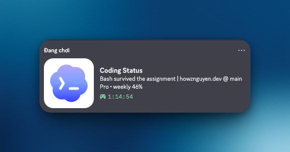
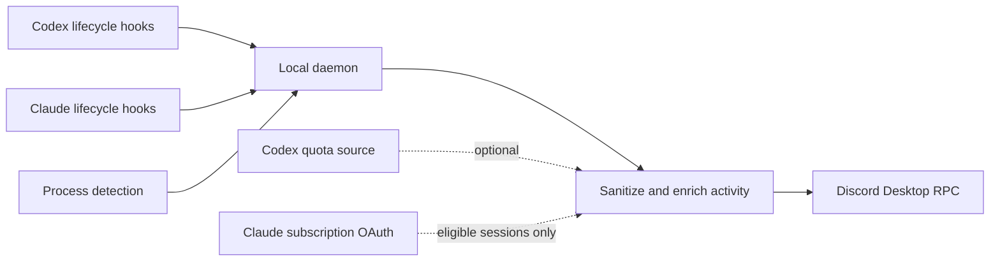

<p align="center">
  
</p>

<h1 align="center">Discord Coding Status</h1>

<p align="center">
  Real-time Discord Rich Presence for Codex and Claude Code.
</p>

<p align="center">
  <a href="https://www.npmjs.com/package/discord-coding-status"></a>
  <a href="https://howznguyen.dev/projects/discord-coding-status"></a>
  <a href="https://nodejs.org/"></a>
  
  <a href="./LICENSE"></a>
  <a href="https://knowns.sh/"></a>
  <a href="https://discord.knowns.dev/"></a>
</p>

<p align="center">
  <a href="#quick-start">Quick start</a> ·
  <a href="#configuration">Configuration</a> ·
  <a href="#troubleshooting">Troubleshooting</a> ·
  <a href="./CONTRIBUTING.md">Contributing</a>
</p>

Discord Coding Status is a small local daemon that keeps your Discord activity in sync with your AI coding sessions. It combines lifecycle hooks with process detection, enriches activity with sanitized project metadata, active-model metadata, and optional native quota, then publishes it through Discord Desktop's local RPC connection.

> [!NOTE]
> This is not a Discord bot or webhook. It does not need a bot token, public server, or cloud relay. Discord Desktop must be running on the same computer.

## Why use it?

- **Real-time updates** - Codex and Claude Code hook changes reach Discord immediately; polling remains as a fallback.
- **Codex and Claude Code** - separate Discord application identities are built in for both tools.
- **Useful context** - show activity, sanitized repository name, branch, package, and quota according to your privacy level.
- **Quota aware** - read Codex quota from OAuth/app-server RPC and Claude subscription quota from Claude Code OAuth.
- **Local-first** - session state stays on your machine and Rich Presence uses Discord's local IPC/RPC transport.
- **Starts with your session** - installs a LaunchAgent on macOS or a Scheduled Task on Windows.
- **Tested without Discord** - integration and stress tests use a deterministic local RPC transport.

## How it works



The state file is watched for immediate changes. A 10-second process/polling loop keeps working as a fallback when hooks or file watching are unavailable.

## Supported tools

| Tool | Activity source | Native quota | Discord identity |
| --- | --- | --- | --- |
| Codex CLI | Lifecycle hooks + process fallback | OAuth or app-server RPC | Codex |
| Codex in ChatGPT desktop | Process detection | OAuth or app-server RPC | Codex |
| Claude Code | Lifecycle hooks + process fallback | Subscription OAuth | Claude Code |
| Claude Desktop | Process detection | — | Claude Code |

If Codex and Claude are active together, the daemon updates both RPC clients. Discord Desktop decides which activities are visible in its interface. Claude Desktop detection is independent from Claude Code hooks and subscription quota.

## Requirements

- Node.js 18 or newer
- Discord Desktop, signed in and running
- Codex CLI, ChatGPT desktop with Codex, Claude Code, or Claude Desktop
- macOS or Windows for automatic startup installation

Linux can run the daemon manually, but `setup` and `uninstall` currently manage startup only on macOS and Windows.

## Quick start

Run the package without a subcommand to print project information, available commands, paths, and examples. This does not start the daemon:

```sh
npx -y discord-coding-status@latest
```

### 1. Install and start

```sh
npx -y discord-coding-status@latest setup
```

Setup performs four actions:

1. Detects local Codex/ChatGPT and Claude CLI or desktop installations.
2. Copies a self-contained runtime into your user application-data directory.
3. Installs and starts a macOS LaunchAgent or Windows Scheduled Task.
4. Installs managed Codex hooks when Codex is detected and Claude hooks when Claude Code is detected.

Force hook installation if a tool was not detected:

```sh
npx -y discord-coding-status@latest setup --codex-hooks
npx -y discord-coding-status@latest setup --claude-hooks
```

Skip either managed hook set:

```sh
npx -y discord-coding-status@latest setup --no-codex-hooks
npx -y discord-coding-status@latest setup --no-claude-hooks
```

### 2. Trust Codex hooks

After installing or changing hooks, open Codex and run:

```text
/hooks
```

Review and trust the six Discord Coding Status command hooks. This approval is required by Codex before the hooks can run.

### 3. Verify the installation

```sh
npx discord-coding-status status
npx discord-coding-status codex-hooks-status
npx discord-coding-status claude-hooks-status
npx discord-coding-status quota --source oauth
npx discord-coding-status quota --tool claude
```

Start a Codex or Claude Code session, then submit a prompt or use a tool. Discord should update within moments.

### Updating

Run setup from the latest published package to replace the copied runtime, refresh its production dependencies, reload startup, and update the managed hooks:

```sh
npx -y discord-coding-status@latest setup --codex-hooks --claude-hooks
```

Existing user configuration and session state are preserved. If the managed hook commands changed, open Codex and run `/hooks` to review and trust them again.

## What Discord displays

The default `project` detail level produces two lines:

```text
<activity> | <project @ branch>
<raw model> | <plan> • <usage windows>
```

For example:

```text
Bash survived the assignment | my-project @ main
claude-sonnet-4-6 | Pro • 5h 75% • weekly 60%
```

Usage percentages are shown as **remaining** quota. Codex window labels come from the returned duration. Claude V1 displays only the subscription plan, 5-hour Session, and 7-day Weekly windows.

### Detail levels

| Level | Activity | Project + branch | Model + effort | Quota | Context | Package name |
| --- | --- | --- | --- | --- | --- | --- |
| `safe` | Yes | No | Yes | No | No | No |
| `project` (default) | Yes | Yes | Yes | Yes | No | No |
| `full` | Yes | Yes | Yes | Yes | No | Yes |

Project values are sanitized before being sent to Discord. Full filesystem paths are not used as Rich Presence text.

## Configuration

Setup writes compact JSON configuration to:

```text
~/discord-coding-status/config.json
```

Most users can keep the default `{}`. Edit configuration interactively with:

```sh
npx discord-coding-status config
```

The full-screen terminal editor shows a live two-line preview matching Discord's
`details` and `state` rows. Use the arrow keys to move, Space or Enter to toggle a
block, Left/Right to change a choice, `S` to save, and `Q` to cancel.

The available display blocks are:

- Top line: activity and project + branch.
- Bottom line: model + reasoning effort, plan + quota, context usage, and package name.

Activity text supports four styles selected directly in the TUI:

| Style | Example |
| --- | --- |
| `fun` (default) | `Bash survived the assignment` |
| `normal` | `Using Bash` |
| `technical` | `Running npm test` |
| `minimal` | `Working` |

Context is optional and fail-closed: it appears only when a hook supplies a numeric
metric such as `42%` or `128k / 256k`. Free-form context text is discarded so prompt
or transcript content cannot become Discord activity.

Press `A` from the TUI, or run `config --advanced`, to edit path, text, and image
overrides with the original prompt-based editor. For scripts and quick inspection:

```sh
npx discord-coding-status config --show
npx discord-coding-status config --preview
npx discord-coding-status config --reset
```

Saving or resetting config automatically restarts a managed macOS LaunchAgent or
Windows Scheduled Task, so changes become active immediately. Add `--no-restart`
to skip that behavior. Linux and manually started daemons must still be restarted
through their external service manager or terminal session.

Example:

```json
{
  "detailLevel": "project",
  "quotaSource": "oauth",
  "activityStyle": "normal",
  "showActivity": true,
  "showProject": true,
  "showModel": true,
  "showQuota": true,
  "showContext": false,
  "showPackage": false,
  "codexAuthFile": "~/.codex/auth.json",
  "preferCodexCli": false
}
```

### Common options

| JSON key | Default | Purpose |
| --- | --- | --- |
| `detailLevel` | `project` | Select `safe`, `project`, or `full` presence detail. |
| `quotaSource` | `oauth` | Select `oauth`, `rpc`, `auto`, or `off`. |
| `activityStyle` | `fun` | Select `fun`, `normal`, `technical`, or `minimal` activity text. |
| `showActivity` | `true` | Show activity on the top line. |
| `showProject` | preset | Show project and branch on the top line. |
| `showModel` | `true` | Show model and reasoning effort on the bottom line. |
| `showQuota` | preset | Show plan and quota on the bottom line. |
| `showContext` | `false` | Show sanitized numeric context usage on the bottom line when available. |
| `showPackage` | preset | Show package name on the bottom line. |
| `codexAuthFile` | `~/.codex/auth.json` | Override the Codex OAuth credential file. |
| `stateFile` | `~/discord-coding-status/states.json` | Override local hook/runtime state storage. |
| `planText` | - | Override the displayed plan text. |
| `limitsText` | - | Override the displayed quota text. |
| `codexClientId` | built in | Override the Discord application ID used for Codex. |
| `claudeClientId` | built in | Override the Discord application ID used for Claude Code. |
| `codexImageKey` | - | Use an uploaded asset key from the Codex Discord application. |
| `claudeImageKey` | - | Use an uploaded asset key from the Claude Discord application. |
| `preferCodexCli` | `false` | Prefer CLI process detection when Codex App and CLI are both active. |

See [`.env.example`](./.env.example) for advanced environment overrides used during local development.

### Discord application IDs and images

The built-in application IDs are:

- Codex: `1517375602662051900`
- Claude Code: `1521213655092428923`

Tool-specific IDs let Codex and Claude Code use separate Discord identities. Custom image keys work only when the matching asset already exists in that Discord application.

## Codex quota

Codex quota support is experimental because the ChatGPT usage endpoint and Codex app-server RPC are not public stable APIs.

| Source | Behavior |
| --- | --- |
| `oauth` | Reads the local Codex auth file and calls the ChatGPT Codex usage endpoint. This is the default. |
| `rpc` | Starts `codex -s read-only -a untrusted app-server` and calls `account/rateLimits/read`. |
| `auto` | Tries OAuth first, then app-server RPC. |
| `off` | Disables native quota lookup. |

Check the current value directly:

```sh
npx discord-coding-status quota --source oauth
```

Quota refreshes run in the background. A slow or unavailable endpoint cannot block a hook activity update from reaching Discord. After the first successful refresh, the daemon keeps showing the last known quota value during temporary failures and replaces it only when fresh quota arrives.

OAuth access and refresh tokens are read from your local Codex auth file. They are used only with the relevant OpenAI authentication/usage endpoints and are never included in Discord Rich Presence.

## Claude quota and model detection

Managed Claude hooks read only the raw model ID from hook metadata or the bounded tail of the referenced local transcript. Prompt and response content is not copied into state, logs, quota requests, or Discord activity. A model change is picked up on the next managed event; an incomplete transcript keeps the last-known model for that session.

For a compatible Claude subscription login, check the same quota text used by presence:

```sh
npx discord-coding-status quota --tool claude
```

Claude quota reads Claude Code OAuth credentials from the macOS Keychain first and `$CLAUDE_CONFIG_DIR/.credentials.json` (default `~/.claude/.credentials.json`) second. It requests only Anthropic's fixed OAuth usage/refresh hosts, refreshes every five minutes, honors `Retry-After`, and keeps the last successful value only in daemon memory.

Quota is fail-closed: Anthropic API-key mode (including `apiKeyHelper`), `ANTHROPIC_AUTH_TOKEN`, `CLAUDE_CODE_OAUTH_TOKEN`, a custom `ANTHROPIC_BASE_URL`, Bedrock, Vertex, Foundry, Mantle, and Anthropic-on-AWS modes can still show Claude's recorded raw model but never use stored subscription OAuth credentials or display Claude subscription quota. Tokens with explicit scopes must include `user:profile`.

## Codex hooks

Install, inspect, or remove only the hooks managed by this project:

```sh
npx discord-coding-status setup-codex-hooks
npx discord-coding-status codex-hooks-status
npx discord-coding-status uninstall-codex-hooks
```

The installer merges hooks into `~/.codex/hooks.json` for:

- `SessionStart`
- `UserPromptSubmit`
- `PreToolUse`
- `PermissionRequest`
- `PostToolUse`
- `Stop`

Native Codex hooks provide the active model. The daemon also reads the latest local `turn_context` entry referenced by the hook transcript to capture reasoning effort, so Rich Presence can show values such as `gpt-5.6-sol · xhigh`. Transcript prompts and responses are not included in Discord activity.

Existing hook configuration is preserved, and the previous file is backed up as `hooks.json.bak` before a change is written.

## Claude hooks

Install, inspect, disable, or remove only the hooks managed by this project:

```sh
npx discord-coding-status setup-claude-hooks
npx discord-coding-status claude-hooks-status
npx discord-coding-status disable-claude-hooks
npx discord-coding-status uninstall-claude-hooks
```

The installer merges nine lifecycle events into `$CLAUDE_CONFIG_DIR/settings.json` (default `~/.claude/settings.json`). Each owned command contains `--managed-by=discord-coding-status`; status and uninstall use that marker, preserving unrelated settings, hook groups, and commands. The previous settings file is backed up as `settings.json.bak` before a write.

### Generic hook input

Local wrappers can publish exact state for Codex, Claude Code, or another tool:

```sh
npx discord-coding-status hook \
  --tool claude \
  --surface cli \
  --status running \
  --session-id my-session \
  --cwd "$PWD" \
  --activity "Working with Claude Code"
```

Inspect or clear local sessions:

```sh
npx discord-coding-status state
npx discord-coding-status clear --session-id my-session
```

Concurrent hook writes use a lock plus atomic file replacement so burst updates do not corrupt the state file.

## CLI reference

| Command | Description |
| --- | --- |
| `setup` | Install the runtime/startup entry, start the daemon, and auto-install detected Codex and Claude hooks. |
| `config` | Open the display TUI with a live two-line Discord preview. |
| `config --advanced` | Edit advanced path, text, and image overrides with prompts. |
| `config --preview` | Print the current two-line preview without opening the TUI. |
| `config --no-restart` | Save config without restarting a managed daemon. |
| `daemon` | Run the Rich Presence daemon in the foreground. |
| `status` | Print startup installation paths and status as JSON. |
| `uninstall` | Remove the managed startup entry and installed runtime. |
| `setup-codex-hooks` | Install the six Codex lifecycle hooks. |
| `codex-hooks-status` | Print managed hook status as JSON. |
| `uninstall-codex-hooks` | Remove only hooks installed by this project. |
| `setup-claude-hooks` / `enable-claude-hooks` | Install the nine managed Claude lifecycle hooks. |
| `claude-hooks-status` | Print managed Claude hook status as JSON. |
| `disable-claude-hooks` / `uninstall-claude-hooks` | Remove only Claude hooks installed by this project. |
| `quota [--source SOURCE]` | Read and print Codex plan/quota information (backward-compatible default). |
| `quota --tool claude` | Read and print eligible Claude subscription plan/Session/Weekly quota. |
| `hook --tool TOOL ...` | Write or update a local session state. |
| `codex-hook --event EVENT` | Receive a native Codex lifecycle event. |
| `claude-hook --event EVENT` | Receive a native Claude lifecycle event. |
| `state` | Print current sanitized, non-expired session state. |
| `clear --session-id ID` | Remove one local session. |
| `--help` / `--version` | Print CLI help or version. |

Useful setup flags:

| Flag | Effect |
| --- | --- |
| `--codex-hooks` | Force Codex hook installation. |
| `--no-codex-hooks` | Skip Codex hook installation. |
| `--claude-hooks` | Force Claude hook installation. |
| `--no-claude-hooks` | Skip Claude hook installation. |
| `--codex-quota-source SOURCE` | Persist the selected quota source during setup. |
| `--no-start` | Install startup without starting it immediately. |
| `--dry-run` | Print detected paths and planned actions without installing. |
| `uninstall --purge` | Also remove local configuration and state data. |

## Platform behavior

| Platform | Startup mechanism | Logs |
| --- | --- | --- |
| macOS | `~/Library/LaunchAgents/io.github.discord-coding-status.daemon.plist` | `~/Library/Logs/discord-coding-status/` |
| Windows | User Scheduled Task named `DiscordCodingStatus` | `%LOCALAPPDATA%\discord-coding-status\logs\` |
| Linux | Run `discord-coding-status daemon` manually or use your own service manager | Standard output/error |

Runtime state is stored in `~/discord-coding-status/` on every platform unless overridden.

## Privacy and security

- Discord receives short, sanitized Rich Presence strings, not prompt text, full paths, account emails, secrets, repository URLs, or raw command lines.
- `safe` mode hides repository, branch, package, and quota metadata.
- Hook/runtime state remains in the local state file; stale sessions expire automatically.
- Discord activity is sent through the local Desktop RPC/IPC connection.
- Codex quota contacts the configured OpenAI authentication/usage endpoint. Eligible Claude quota contacts only `api.anthropic.com` and `platform.claude.com`; Claude OAuth tokens are never sent to a custom base URL, gateway, router, or Discord.
- Claude transcript parsing selects only model metadata from a bounded local tail and never persists raw transcript lines.
- No Discord bot token, public HTTP listener, hosted backend, or telemetry service is required.

Please report sensitive issues according to [SECURITY.md](./SECURITY.md).

## Troubleshooting

### Discord shows no activity

1. Make sure **Discord Desktop** is open and signed in; the browser client does not provide local RPC.
2. Confirm startup is installed:

   ```sh
   npx discord-coding-status status
   ```

3. For Codex, confirm all six hooks are installed:

   ```sh
   npx discord-coding-status codex-hooks-status
   ```

   For Claude Code, confirm all nine managed hooks are installed:

   ```sh
   npx discord-coding-status claude-hooks-status
   ```

4. Open Codex, run `/hooks`, and trust the Discord Coding Status hooks.
5. Submit a new prompt or run a tool so the session emits a fresh lifecycle event.
6. Run the daemon in the foreground to see connection errors directly:

   ```sh
   npx discord-coding-status daemon
   ```

### Hooks are installed but do not update

Reinstall the current runtime and hooks, then review the Codex hooks again in Codex:

```sh
npx discord-coding-status setup --codex-hooks --claude-hooks
```

The daemon watches the state directory, so changes normally arrive without waiting for the polling interval.

### Quota is unavailable

Verify the quota path independently:

```sh
npx discord-coding-status quota --source oauth
npx discord-coding-status quota --tool claude
```

For Codex, make sure `~/.codex/auth.json` exists. For Claude, sign in through Claude Code with subscription OAuth and ensure the active session is not using an API key, environment token, custom base URL, or cloud provider. Claude quota intentionally remains hidden in those modes while model display continues.

If you do not want Codex quota lookup, disable it without disabling Rich Presence:

```json
{
  "quotaSource": "off"
}
```

### Inspect logs

macOS:

```sh
tail -f ~/Library/Logs/discord-coding-status/discord-coding-status.log
tail -f ~/Library/Logs/discord-coding-status/discord-coding-status.error.log
```

Windows logs are written under:

```text
%LOCALAPPDATA%\discord-coding-status\logs\
```

### Remove everything

Remove managed hooks before deleting the installed runtime they reference:

```sh
npx discord-coding-status uninstall-codex-hooks
npx discord-coding-status uninstall-claude-hooks
npx discord-coding-status uninstall --purge
```

## Run from source

```sh
npm ci
npm run build
node dist/cli.js setup --codex-hooks
```

Run without installing startup:

```sh
node dist/cli.js daemon
```

Test the local package entrypoint:

```sh
npx . --help
npx . setup --dry-run
```

## Development

Detection code is split by responsibility:

| Module | Responsibility |
| --- | --- |
| `src/cli.ts` | CLI commands and daemon orchestration |
| `src/commands/` | Command handlers and command-specific policy/types |
| `src/core/` | Pure tool, detection, hook, presence, and quota contracts/logic |
| `src/providers/` | Capability declarations and the built-in provider registry |
| `src/adapters/system/installed-tools.ts` | Installed CLI/desktop discovery |
| `src/adapters/system/processes.ts` | macOS/Windows process enumeration |
| `src/core/detection/active-tools.ts` | Active-tool selection policy |
| `src/core/detection/tool-detection.ts` | Pure Codex/Claude process classifiers |

Dependencies point inward: commands and adapters may import core modules, while core modules do not import commands or platform adapters. Domain types live beside their owning feature instead of in a global types file.

See [Adding a tool provider](./docs/adding-a-tool-provider.md) for the provider contract, supported installation probes, Discord environment conventions, and a complete extension example.

```sh
npm ci
npm test
npm run test:integration
npm run test:stress
npm pack --dry-run
```

`npm test` builds TypeScript and runs quota, hook-to-Discord, clear, and concurrent state-writer coverage through a local fake RPC transport. No Discord Desktop session is required for automated tests.

CI covers Node.js 18, 20, and 22 on Linux, plus Node.js 20 on macOS and Windows.

See [CONTRIBUTING.md](./CONTRIBUTING.md) for pull-request expectations and local manual checks.

## Release

Configure the repository secret `NPM_TOKEN` and add yourself as a required reviewer for the `npm-production` GitHub Environment. Start **Actions → Release candidate to npm → Run workflow** with a semantic version such as `1.3.0`.

The workflow updates `package.json` and `package-lock.json`, runs the full test and package checks, commits and tags the version, uploads the package artifact, and creates a draft GitHub Release. It then waits at the `npm-production` approval gate. Nothing is published to npm or as a public GitHub Release before approval. After approval, the exact staged tarball is published to npm with provenance and the draft GitHub Release becomes public. A failed build or publish remains visible in GitHub Actions for retry and does not publish the GitHub Release.

Stable releases publish under npm's `latest` dist-tag. Prereleases such as `v1.3.0-beta.1` publish under `next`.

## License

[MIT](./LICENSE) © 2026 Howz Nguyen and contributors.
