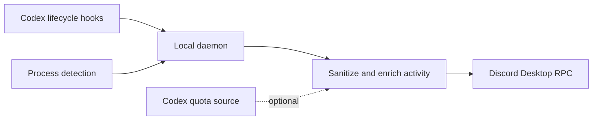

<p align="center">
  
</p>

<h1 align="center">Discord Coding Status</h1>

<p align="center">
  Real-time Discord Rich Presence for Codex and Claude Code.
</p>

<p align="center">
  <a href="https://nodejs.org/"></a>
  
  <a href="./LICENSE"></a>
  <a href="https://knowns.sh/"></a>
  <a href="https://discord.knowns.dev/"></a>
</p>

<p align="center">
  <a href="#quick-start">Quick start</a> ·
  <a href="#configuration">Configuration</a> ·
  <a href="#troubleshooting">Troubleshooting</a> ·
  <a href="./CONTRIBUTING.md">Contributing</a>
</p>

Discord Coding Status is a small local daemon that keeps your Discord activity in sync with your AI coding sessions. It combines lifecycle hooks with process detection, enriches activity with sanitized project metadata and optional Codex quota, then publishes it through Discord Desktop's local RPC connection.

> [!NOTE]
> This is not a Discord bot or webhook. It does not need a bot token, public server, or cloud relay. Discord Desktop must be running on the same computer.

## Why use it?

- **Real-time updates** - Codex hook changes reach Discord immediately; polling remains as a fallback.
- **Codex and Claude Code** - separate Discord application identities are built in for both tools.
- **Useful context** - show activity, sanitized repository name, branch, package, and quota according to your privacy level.
- **Quota aware** - read the Codex plan and active usage windows from OAuth or Codex app-server RPC.
- **Local-first** - session state stays on your machine and Rich Presence uses Discord's local IPC/RPC transport.
- **Starts with your session** - installs a LaunchAgent on macOS or a Scheduled Task on Windows.
- **Tested without Discord** - integration and stress tests use a deterministic local RPC transport.

## How it works



The state file is watched for immediate changes. A 10-second process/polling loop keeps working as a fallback when hooks or file watching are unavailable.

## Supported tools

| Tool | Activity source | Native quota | Discord identity |
| --- | --- | --- | --- |
| Codex CLI | Lifecycle hooks + process fallback | OAuth or app-server RPC | Codex |
| Codex App | Process detection | OAuth or app-server RPC | Codex |
| Claude Code | Process detection + generic hook input | - | Claude Code |

If Codex and Claude Code are active together, the daemon updates both RPC clients. Discord Desktop decides which activities are visible in its interface.

## Requirements

- Node.js 18 or newer
- Discord Desktop, signed in and running
- Codex CLI, Codex App, or Claude Code
- macOS or Windows for automatic startup installation

Linux can run the daemon manually, but `setup` and `uninstall` currently manage startup only on macOS and Windows.

## Quick start

### 1. Install and start

```sh
npx discord-coding-status setup
```

Setup performs four actions:

1. Detects local Codex and Claude Code installations.
2. Copies a self-contained runtime into your user application-data directory.
3. Installs and starts a macOS LaunchAgent or Windows Scheduled Task.
4. Installs Codex lifecycle hooks automatically when Codex is detected.

Force hook installation if Codex was not detected:

```sh
npx discord-coding-status setup --codex-hooks
```

Skip Codex hooks:

```sh
npx discord-coding-status setup --no-codex-hooks
```

### 2. Trust Codex hooks

After installing or changing hooks, open Codex and run:

```text
/hooks
```

Review and trust the six Discord Coding Status command hooks. This approval is required by Codex before the hooks can run.

### 3. Verify the installation

```sh
npx discord-coding-status status
npx discord-coding-status codex-hooks-status
npx discord-coding-status quota --source oauth
```

Start a Codex or Claude Code session, then submit a prompt or use a tool. Discord should update within moments.

## What Discord displays

The default `project` detail level produces two lines:

```text
<activity> | <project @ branch>
<plan> • <usage windows>
```

For example:

```text
Bash survived the assignment | my-project @ main
Pro • weekly 54%
```

Usage percentages are shown as **remaining** quota. Window labels come from the duration returned by Codex, so a 300-minute window becomes `5h` and a 604800-second window becomes `weekly` regardless of whether the API calls it `primary` or `secondary`.

### Detail levels

| Level | Activity | Project + branch | Quota | Package name |
| --- | --- | --- | --- | --- |
| `safe` | Yes | No | No | No |
| `project` (default) | Yes | Yes | Yes | No |
| `full` | Yes | Yes | Yes | Yes |

Project values are sanitized before being sent to Discord. Full filesystem paths are not used as Rich Presence text.

## Configuration

Setup writes compact JSON configuration to:

```text
~/discord-coding-status/config.json
```

Most users can keep the default `{}`. Edit configuration interactively with:

```sh
npx discord-coding-status config
```

Press Enter to keep a value or enter `-` to clear an override. For scripts:

```sh
npx discord-coding-status config --show
npx discord-coding-status config --reset
```

Example:

```json
{
  "detailLevel": "project",
  "quotaSource": "oauth",
  "codexAuthFile": "~/.codex/auth.json",
  "preferCodexCli": false
}
```

### Common options

| JSON key | Default | Purpose |
| --- | --- | --- |
| `detailLevel` | `project` | Select `safe`, `project`, or `full` presence detail. |
| `quotaSource` | `oauth` | Select `oauth`, `rpc`, `auto`, or `off`. |
| `codexAuthFile` | `~/.codex/auth.json` | Override the Codex OAuth credential file. |
| `stateFile` | `~/discord-coding-status/states.json` | Override local hook/runtime state storage. |
| `planText` | - | Override the displayed plan text. |
| `limitsText` | - | Override the displayed quota text. |
| `codexClientId` | built in | Override the Discord application ID used for Codex. |
| `claudeClientId` | built in | Override the Discord application ID used for Claude Code. |
| `codexImageKey` | - | Use an uploaded asset key from the Codex Discord application. |
| `claudeImageKey` | - | Use an uploaded asset key from the Claude Discord application. |
| `preferCodexCli` | `false` | Prefer CLI process detection when Codex App and CLI are both active. |

See [`.env.example`](./.env.example) for advanced environment overrides used during local development.

### Discord application IDs and images

The built-in application IDs are:

- Codex: `1517375602662051900`
- Claude Code: `1521213655092428923`

Tool-specific IDs let Codex and Claude Code use separate Discord identities. Custom image keys work only when the matching asset already exists in that Discord application.

## Codex quota

Codex quota support is experimental because the ChatGPT usage endpoint and Codex app-server RPC are not public stable APIs.

| Source | Behavior |
| --- | --- |
| `oauth` | Reads the local Codex auth file and calls the ChatGPT Codex usage endpoint. This is the default. |
| `rpc` | Starts `codex -s read-only -a untrusted app-server` and calls `account/rateLimits/read`. |
| `auto` | Tries OAuth first, then app-server RPC. |
| `off` | Disables native quota lookup. |

Check the current value directly:

```sh
npx discord-coding-status quota --source oauth
```

Quota refreshes run in the background. A slow or unavailable endpoint cannot block a hook activity update from reaching Discord. After the first successful refresh, the daemon keeps showing the last known quota value during temporary failures and replaces it only when fresh quota arrives.

OAuth access and refresh tokens are read from your local Codex auth file. They are used only with the relevant OpenAI authentication/usage endpoints and are never included in Discord Rich Presence.

## Codex hooks

Install, inspect, or remove only the hooks managed by this project:

```sh
npx discord-coding-status setup-codex-hooks
npx discord-coding-status codex-hooks-status
npx discord-coding-status uninstall-codex-hooks
```

The installer merges hooks into `~/.codex/hooks.json` for:

- `SessionStart`
- `UserPromptSubmit`
- `PreToolUse`
- `PermissionRequest`
- `PostToolUse`
- `Stop`

Native Codex hooks provide the active model. The daemon also reads the latest local `turn_context` entry referenced by the hook transcript to capture reasoning effort, so Rich Presence can show values such as `gpt-5.6-sol · xhigh`. Transcript prompts and responses are not included in Discord activity.

Existing hook configuration is preserved, and the previous file is backed up as `hooks.json.bak` before a change is written.

### Generic hook input

Local wrappers can publish exact state for Codex, Claude Code, or another tool:

```sh
npx discord-coding-status hook \
  --tool claude \
  --surface cli \
  --status running \
  --session-id my-session \
  --cwd "$PWD" \
  --activity "Working with Claude Code"
```

Inspect or clear local sessions:

```sh
npx discord-coding-status state
npx discord-coding-status clear --session-id my-session
```

Concurrent hook writes use a lock plus atomic file replacement so burst updates do not corrupt the state file.

## CLI reference

| Command | Description |
| --- | --- |
| `setup` | Install the runtime and startup entry, start the daemon, and auto-install detected Codex hooks. |
| `config` | Edit the JSON configuration interactively. |
| `daemon` | Run the Rich Presence daemon in the foreground. |
| `status` | Print startup installation paths and status as JSON. |
| `uninstall` | Remove the managed startup entry and installed runtime. |
| `setup-codex-hooks` | Install the six Codex lifecycle hooks. |
| `codex-hooks-status` | Print managed hook status as JSON. |
| `uninstall-codex-hooks` | Remove only hooks installed by this project. |
| `quota [--source SOURCE]` | Read and print Codex plan/quota information. |
| `hook --tool TOOL ...` | Write or update a local session state. |
| `codex-hook --event EVENT` | Receive a native Codex lifecycle event. |
| `state` | Print current sanitized, non-expired session state. |
| `clear --session-id ID` | Remove one local session. |
| `--help` / `--version` | Print CLI help or version. |

Useful setup flags:

| Flag | Effect |
| --- | --- |
| `--codex-hooks` | Force Codex hook installation. |
| `--no-codex-hooks` | Skip Codex hook installation. |
| `--codex-quota-source SOURCE` | Persist the selected quota source during setup. |
| `--no-start` | Install startup without starting it immediately. |
| `--dry-run` | Print detected paths and planned actions without installing. |
| `uninstall --purge` | Also remove local configuration and state data. |

## Platform behavior

| Platform | Startup mechanism | Logs |
| --- | --- | --- |
| macOS | `~/Library/LaunchAgents/io.github.discord-coding-status.daemon.plist` | `~/Library/Logs/discord-coding-status/` |
| Windows | User Scheduled Task named `DiscordCodingStatus` | `%LOCALAPPDATA%\discord-coding-status\logs\` |
| Linux | Run `discord-coding-status daemon` manually or use your own service manager | Standard output/error |

Runtime state is stored in `~/discord-coding-status/` on every platform unless overridden.

## Privacy and security

- Discord receives short, sanitized Rich Presence strings, not prompt text, full paths, account emails, secrets, repository URLs, or raw command lines.
- `safe` mode hides repository, branch, package, and quota metadata.
- Hook/runtime state remains in the local state file; stale sessions expire automatically.
- Discord activity is sent through the local Desktop RPC/IPC connection.
- When quota is enabled, the daemon contacts the configured OpenAI authentication/usage endpoint. Tokens are never sent to Discord.
- No Discord bot token, public HTTP listener, hosted backend, or telemetry service is required.

Please report sensitive issues according to [SECURITY.md](./SECURITY.md).

## Troubleshooting

### Discord shows no activity

1. Make sure **Discord Desktop** is open and signed in; the browser client does not provide local RPC.
2. Confirm startup is installed:

   ```sh
   npx discord-coding-status status
   ```

3. For Codex, confirm all six hooks are installed:

   ```sh
   npx discord-coding-status codex-hooks-status
   ```

4. Open Codex, run `/hooks`, and trust the Discord Coding Status hooks.
5. Submit a new prompt or run a tool so the session emits a fresh lifecycle event.
6. Run the daemon in the foreground to see connection errors directly:

   ```sh
   npx discord-coding-status daemon
   ```

### Hooks are installed but do not update

Reinstall the current runtime and hooks, then review them again in Codex:

```sh
npx discord-coding-status setup --codex-hooks
```

The daemon watches the state directory, so changes normally arrive without waiting for the polling interval.

### Quota is unavailable

Verify the quota path independently:

```sh
npx discord-coding-status quota --source oauth
```

Make sure Codex is signed in and `~/.codex/auth.json` exists. If you do not want quota lookup, disable it without disabling Rich Presence:

```json
{
  "quotaSource": "off"
}
```

### Inspect logs

macOS:

```sh
tail -f ~/Library/Logs/discord-coding-status/discord-coding-status.log
tail -f ~/Library/Logs/discord-coding-status/discord-coding-status.error.log
```

Windows logs are written under:

```text
%LOCALAPPDATA%\discord-coding-status\logs\
```

### Remove everything

Remove managed Codex hooks before deleting the installed runtime they reference:

```sh
npx discord-coding-status uninstall-codex-hooks
npx discord-coding-status uninstall --purge
```

## Run from source

```sh
npm ci
npm run build
node dist/cli.js setup --codex-hooks
```

Run without installing startup:

```sh
node dist/cli.js daemon
```

Test the local package entrypoint:

```sh
npx . --help
npx . setup --dry-run
```

## Development

```sh
npm ci
npm test
npm run test:integration
npm run test:stress
npm pack --dry-run
```

`npm test` builds TypeScript and runs quota, hook-to-Discord, clear, and concurrent state-writer coverage through a local fake RPC transport. No Discord Desktop session is required for automated tests.

CI covers Node.js 18, 20, and 22 on Linux, plus Node.js 20 on macOS and Windows.

See [CONTRIBUTING.md](./CONTRIBUTING.md) for pull-request expectations and local manual checks.

## Release

The publish workflow runs for `v*` tags, tests and builds the package, then publishes to npm with provenance. Configure the repository secret `NPM_TOKEN`, then create a version tag:

```sh
npm version patch
git push --follow-tags
```

## License

[MIT](./LICENSE) © 2026 Howz Nguyen and contributors.
